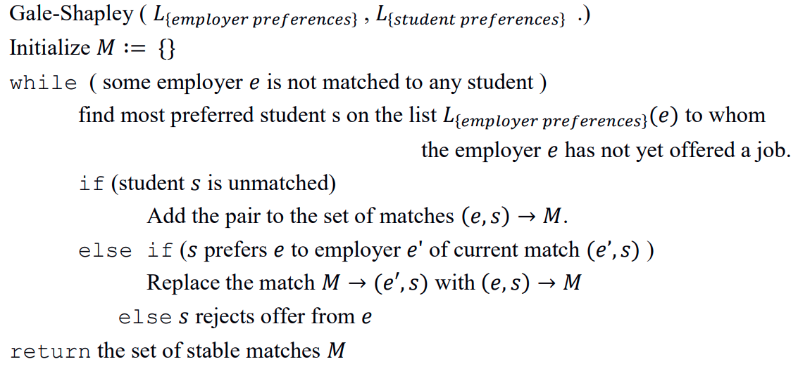
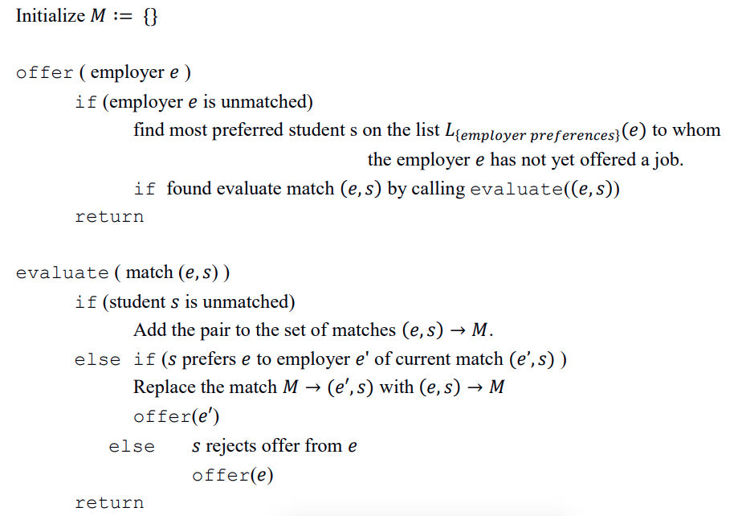

# Stable Marriage Problem

This repository contains multi-paradigm solutions to the SMP. 

Languages in this repo: 
* Go
* Java
* Prolog
* Scheme (Lisp) 

Given a list of 10 employers and 10 students, and given their list of preferences of each other, the SMP solutions attempt to find an optimal match for all students & employers. 

## Example 
Given the following students & their preferences:
* Olivia: Thales,Canada Post,Cisco
* Jackson: Thales,Canada Post,Cisco
* Sophia: Cisco,Thales,Canada Post 

Given the following employers & their preferences:
* Thales: Olivia,Jackson,Sophia
* Canada Post: Sophia,Jackson,Olivia
* Cisco: Olivia,Sophia,Jackson 

An optimal stable match would be: 
* Pair: Canada Post - Jackson
* Pair: Thales - Olivia
* Pair: Cisco - Sophia 

[SMP Wikipedia](https://en.wikipedia.org/wiki/Stable_marriage_problem)

## Implementations 

This repo has SMP implementations in Go, Java, Prolog & Scheme (Lisp), where each solution follows one of the two algorithms below: 

### Gale-Shapley:  

### McVitie-Wilson: 

